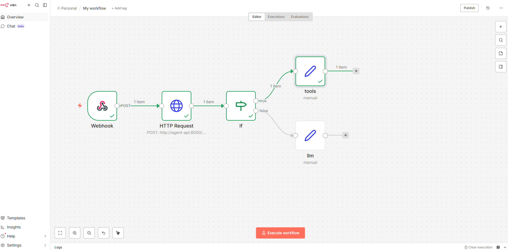

# Project 11 — MCP Tool Server + Agent Runtime + n8n Orchestration

This project demonstrates a production-style AI integration architecture using:

- MCP Tool Server (HTTP/SSE transport)
- Python Agent Runtime with LLM fallback
- FastAPI API layer
- Prometheus metrics
- Docker multi-container orchestration
- n8n workflow automation

The system separates tool execution from agent logic and exposes the agent via API, then integrates it into a workflow automation platform (n8n).


---

## 🧠 Architecture Overview
User / External System
│
▼
n8n Webhook
│
▼
HTTP Request Node
│
▼
Agent API (FastAPI)
│
▼
Agent Runtime
    ├── Tool Call → MCP Server (HTTP/SSE)
    └── LLM Fallback → Groq (LLaMA)

---

### Containers

| Service      | Port  | Responsibility |
|-------------|-------|----------------|
| agent-api   | 8000  | Agent runtime + API |
| mcp-server  | 8001  | Tool execution server |
| n8n         | 5678  | Workflow automation |

---

## 🚀 Quick Start (Docker)

### 1. Set environment variables

Create `.env` in project root:
GROQ_API_KEY=Key_here
GROQ_MODEL=llama-3.1-8b-instant

### 2. Run everything

docker compose up -d --build

### 3. Test API

curl http://localhost:8000/health
curl -X POST http://localhost:8000/query
-H "Content-Type: application/json"
-d "{"text":"12*(3+4)"}"

---

## 🔧 API Endpoints

### POST `/query`

**Request:**

```json
{
  "text": "12*(3+4)"
}
```

**Response:**
{
  "request_id": "...",
  "input": "12*(3+4)",
  "tool_calls": [...],
  "final_answer": {...},
  "llm_latency_ms": null
}

### GET `/metrics`

Prometheus metrics endpoint including:

- HTTP request counters
- Agent run type (tool vs LLM)
- Tool latency histograms
- LLM latency histogram

---

## MCP Tool Server

Exposed over HTTP/SSE at:
http://localhost:8001/mcp

Tools implemented:

- ping
- calculator_safe_eval
- time_now_in_timezone

---

## n8n Workflow Automation

Workflow file is stored in 
n8n/workflows/agent-query.json

Workflow Logic:

1. Webhook receives request
2. HTTP node calls Agent API
3. IF node routes:
    - Tool path
    - LLM fallback path
4. Structured output returned

Example:
POST http://localhost:5678/webhook/agent-query 

---

## Observability: 

- Structured JSON logging 
- Prometheus metrics 
- Docker healthcheck gating
- Retry-safe MCP connection 

--- 

## Enterprise AI Architecture Concept Demonstrated 

- Separation of concerns (tool server vs agent runtime)
- Protocol-level tool orchestration (MCP)
- Network transport over SSE
- Workflow-based AI integration (n8n)
- Containerized multi-service topology
- Healthcheck-driven service orchestration
- Metrics and latency monitoring

---

## Businesss Use Cases: 

- AI-powered ticket enrichment
- Cost estimation automation
- Scheduling assistants
- AI workflow orchestration
- Tool-enabled agent platforms

--- 

