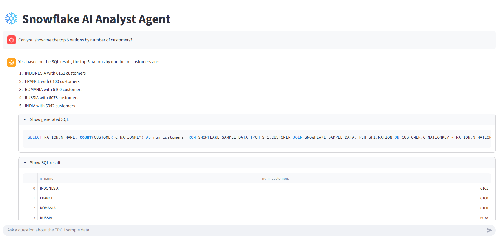

# ❄️ Snowflake AI Analyst Agent  
**LangGraph · LLM Agents · Snowflake · Streamlit**

## 📌 Overview

This project is an **AI-powered analytics agent** that enables users to query a Snowflake data warehouse using natural language.

The agent translates user questions into SQL, executes them safely against Snowflake sample data, and returns concise, data-backed answers through a conversational Streamlit interface.  
The system is built using **LangGraph** to explicitly model agent reasoning, state transitions, and tool execution.

---

## 🎯 Key Capabilities

- Natural language → SQL planning with an LLM  
- Schema-aware SQL generation (prevents hallucinated tables)  
- Read-only SQL safety guardrails  
- Automatic LIMIT enforcement  
- Token-safe result summarization for LLM calls  
- Transparent execution (generated SQL + results visible)  
- Interactive Streamlit chat interface  
- Enterprise-style agent architecture

---

### 🏠 App Home

## 🧠 How It Works

The agent follows a structured workflow:

1. **Planning**  
   The LLM decides whether a user request requires a database query and generates SQL grounded in the known Snowflake schema.

2. **Safety & Validation**  
   Generated SQL is validated to ensure:
   - only `SELECT` / `WITH` queries are allowed  
   - destructive operations are blocked  
   - multi-statement queries are rejected  
   - a safe LIMIT is enforced if missing

3. **Execution**  
   The validated query is executed against Snowflake sample data.

4. **Answer Synthesis**  
   Query results are compacted to stay within token limits and passed to the LLM to generate a final, user-friendly explanation.

5. **User Interface**  
   The Streamlit UI displays:
   - the assistant’s answer  
   - the generated SQL  
   - query results in a readable table  

---

## 🔐 SQL Safety & Reliability

To ensure production-oriented behavior, the agent enforces several guardrails:

- Only read-only SQL queries are permitted  
- Dangerous keywords (`DROP`, `DELETE`, `UPDATE`, etc.) are blocked  
- Multi-statement SQL is rejected  
- Large result sets are truncated before being sent to the LLM  
- Full results can still be viewed safely in the UI  

This separation ensures:
- database safety  
- predictable performance  
- protection against LLM token overflows  

---

## 🧠 Design Highlights 

- **LangGraph for orchestration**  
  Explicit modeling of agent state and reasoning steps.

- **Separation of concerns**  
  Database execution context is kept separate from LLM semantic context.

- **Schema grounding for LLMs**  
  The model is given explicit schema context to avoid SQL hallucinations.

- **Token-aware design**  
  The UI can display large results, while the LLM only sees compact summaries.

- **Production mindset**  
  Guardrails, validation, and transparency are built into the core flow.

---

## 💬 Example Questions

- *How many customers are there?*  
- *Top 5 nations by number of customers*  
- *Show me 1000 customer records*  
- *Total number of orders*  

Each query returns:
- a natural language answer  
- the generated SQL  
- the query result  

---

## 📈 What This Project Demonstrates

- Applied GenAI system design  
- Safe LLM + data warehouse integration  
- Agent-based reasoning with explicit state  
- Enterprise-style AI architecture  
- End-to-end delivery of a production-ready AI application  

---

## 🔮 Possible Extensions

- Schema introspection tools  
- Multi-turn conversational memory  
- Chart generation from query results  
- API-based version (FastAPI)  
- Role-based access control  
