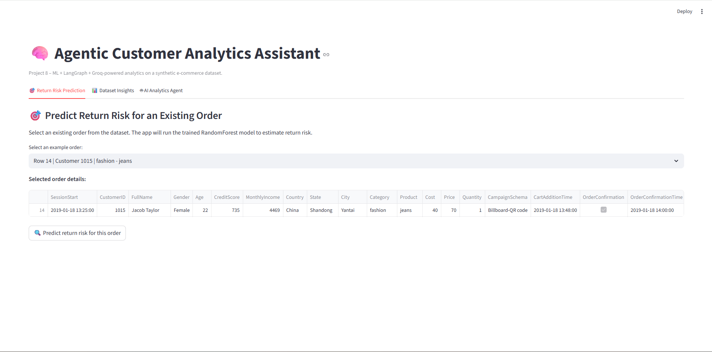
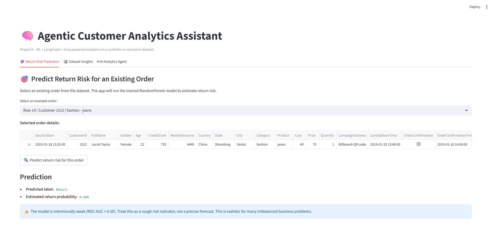
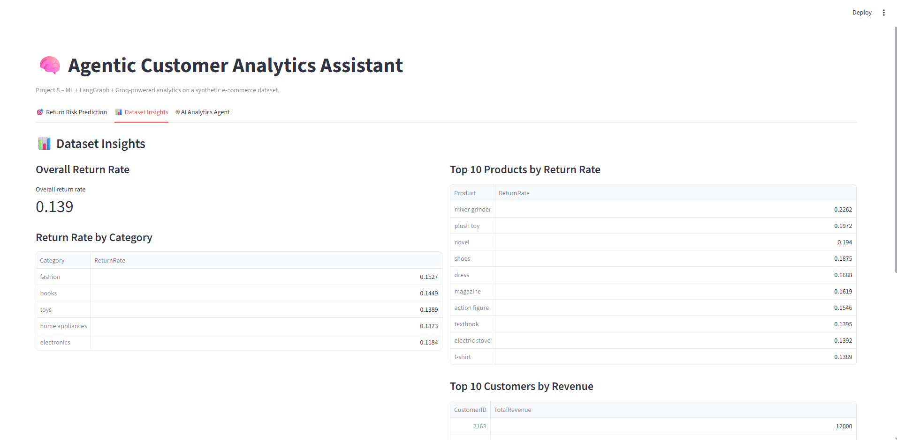
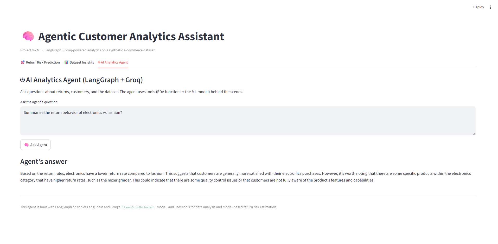

# 🧠 Agentic Customer Analytics Assistant  
### Project 8 — ML + LangChain + LangGraph + Groq + Streamlit

A full-stack AI analytics system that combines:

- **Machine Learning** for predicting order return risk  
- **Tool-using AI Agents** (LangChain)  
- **Structured agent orchestration** via LangGraph  
- **Groq LLaMA-3.1-8B-Instant** as the LLM backend  
- **Streamlit UI** for interactive business analytics  

This project is designed as a **portfolio-ready demonstration** of modern AI engineering and practical machine-learning workflow integration.

---

## 🎯 Project Overview

This project uses a synthetic dataset of 2,000 e-commerce orders and builds:

### **1. Data Engineering & EDA**
- Cleaning and preprocessing  
- Behavior-based feature engineering:
  - Recency  
  - Purchase Frequency  
  - Customer Lifetime Value  
  - Category Return Rate  
  - Return Flags  
- Exploratory analysis of return behavior and customer patterns  

### **2. Machine Learning Model**
A **RandomForestClassifier** is trained to estimate whether an order will be returned.

Performance is intentionally modest:

- Accuracy ≈ 0.82–0.86  
- ROC-AUC ≈ 0.50  

This reflects **real-world business challenges** where predicting returns from limited features is difficult. The project emphasizes engineering, interpretability, and agent integration—not chasing accuracy.

### **3. Agentic Analytics (LangGraph + Groq)**
A structured tool-using agent that can:

- Analyze the dataset  
- Provide summaries and insights  
- Calculate return rates  
- Identify top customers and high-return products  
- Run model-based predictions using the trained RandomForest pipeline  

Tools include:

- `data_overview`  
- `return_rates`  
- `top_customers`  
- `predict_return`  

The agent uses **LangGraph** to orchestrate:

1. LLM reasoning  
2. Tool selection  
3. Tool execution  
4. Response synthesis  

This ensures predictable, transparent, and well-structured agent behavior.

### **4. Streamlit Application**
A user-friendly application with three main tabs:

#### 🎯 **Return Risk Prediction**
- Select any order from the dataset  
- The model predicts return probability  
- The UI clearly communicates that the model is weak and should be treated as a rough indicator  

#### 📊 **Dataset Insights**
- Overall return rate  
- Category-level return patterns  
- Top products by return rate  
- Top 10 customers by total revenue  

#### 🤖 **AI Analytics Agent**
A chat interface backed by the LangGraph agent.  
Users can ask questions such as:

- “Which category has the highest return rate?”  
- “Compare return behavior between electronics and fashion.”  
- “What are the most profitable customers?”  
- “Estimate return risk for this order and explain why.”  

The agent answers using both LLM reasoning and the analytical tools.

---

## 🖼️ UI Preview

Below are example screenshots from the Streamlit application:

### 🏠 App Home

### 🎯 Return Risk Prediction

### 📊 Dataset Insights

### 🤖 AI Analytics Agent

---

## 🧠 Feature Engineering Highlights

The shared function `add_engineered_features()` (used across all notebooks and in the Streamlit app) adds:

- **Recency:** days since last session  
- **Frequency:** number of orders per customer  
- **CustomerTotalRevenue / CustomerAvgRevenue**  
- **CategoryReturnRate:** average return rate per category  
- **ReturnFlag:** binary indicator for provided return reason  

Using a shared function ensures **training and inference use the same pipeline**, which is a crucial MLOps practice.

---

## 🤖 Agentic Workflow (LangGraph)

The LangGraph agent operates as a two-node graph:

### **model node**
- Calls Groq LLaMA-3.1-8B-Instant  
- LLM decides whether to call any tools  
- Outputs either:
  - tool requests  
  - a final natural language message  

### **tools node**
- Executes tool calls (data analysis, ML prediction)  
- Returns structured results via `ToolMessage`  
- Loops back to the model node for reasoning  

The agent stops when the LLM produces a final answer without tool calls.

The agent is accessed through:

run_graph_agent(user_input:str) -> str

---

## 📊 Insights & Explainability

The system can surface:

- Overall return behavior  
- Category-level risk  
- High-risk products  
- High-value customers  
- Drivers of return predictions (narrative explanation from the agent)  

While the ML model is intentionally weak, the agent provides **rich analytical commentary**, transforming a low-signal model into a usable decision-support tool.

---

## 🖥️ Streamlit UI Overview

The Streamlit app acts as the front-end for the system:

### **1. Return Risk Prediction**
Select an order → view:
- model prediction  
- probability  
- explanation  
- full order details  

### **2. Dataset Insights**
Displays data summaries useful for:
- marketing  
- operations  
- customer experience  
- supply chain  

### **3. AI Agent Chat**
A conversational interface where users can ask analytical questions.  
The LangGraph agent:
- decides which tools to call  
- performs analysis  
- returns a structured and clear explanation  

This demonstrates a realistic enterprise AI assistant pattern.

---

## 🧱 Tech Stack

**Data & ML**
- pandas  
- numpy  
- scikit-learn  
- xgboost  
- joblib  

**AI Agents**
- LangChain (tool calling)  
- LangGraph (workflow orchestration)  
- Groq LLaMA-3.1-8B-Instant  

**UI**
- Streamlit  

**Engineering**
- Modular `src/` package  
- Shared feature engineering  
- Reusable tools  
- Structured agent entrypoints  

---

## ⚠️ Limitations

- Dataset is synthetic → real-world generalization is limited  
- ML model is intentionally weak → used mainly to showcase workflow  
- Agent answers may be limited by synthetic data realism  

Nonetheless, the project shows the practical combination of:

- ML + Agents + UI  
- Tool-calling pipelines  
- LangGraph orchestration  
- Realistic business reasoning  

---

## 🔮 Potential Future Enhancements

- Improved ML model (hyperparameter tuning, new features, balancing)  
- Add segmentation (k-means or DBSCAN) as an extra tool for the agent  
- Deploy the Streamlit app online  
- Add user authentication  
- Include visualizations inside the agent responses  
- Integrate an SQL database backend  

---

## ✅ Summary

This project demonstrates a complete **AI analytics system**, combining:

- Machine learning  
- Agentic reasoning  
- Workflow orchestration  
- Data analysis tools  
- Streamlit UI  